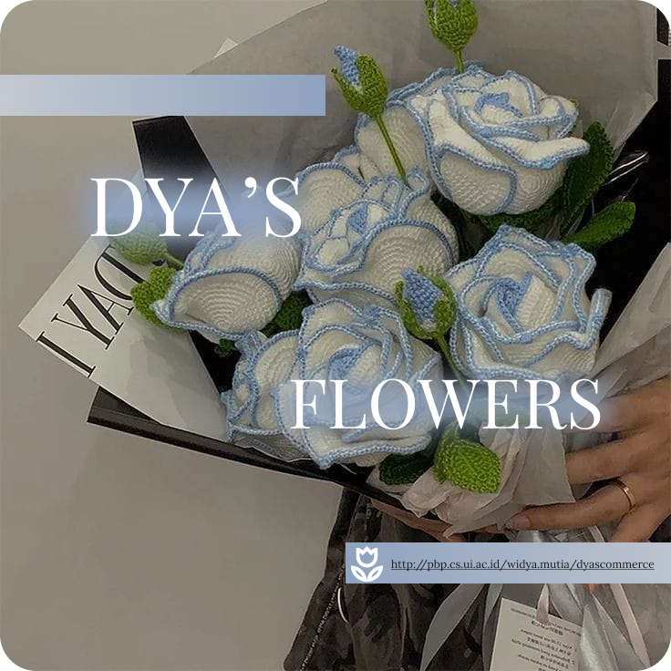

<div align="center">
  <h2>𓍢ִ໋🌷͙֒₊˚*ੈ♡ Welcome to DYA'S FLOWERS ⸝⸝𓍢ִ໋ 🌷͙֒₊˚⋆</h2>
</div>     



***
**Nama**: Widya Mutia Ichsan  
**NPM**: 2306165912  
**Kelas**: PBP E  
--- 


---
#                   Table of Contents
- [TUGAS INDIVIDU 7](#tugas-individu-7)
- [TUGAS INDIVIDU 8](#tugas-individu-8)
- [TUGAS INDIVIDU 9](#tugas-individu-9)


***
#                  TUGAS INDIVIDU 7

## Jelaskan apa yang dimaksud dengan stateless widget dan stateful widget, dan jelaskan perbedaan dari keduanya.

**stateless widget** : widget yang nggak nyimpen status internal. Setelah widget ini dibuild, isinya bakal tetap sama selama siklusnya. Kalau ada perubahan, ya harus dibuild ulang pakai data baru. Contoh gampangnya, kayak tombol yang cuma nunjukin teks tanpa perlu interaksi atau perubahan.

**statefull widget** : kebalikan dari `stateless`. Widget ini bisa nyimpen dan ngelola status internalnya. Status ini bisa berubah, dan pas berubah, widget-nya bakal di-update supaya sesuai dengan status yang baru. Contoh yang umum adalah form input, di mana *user* bisa ngisi data, dan status widget-nya harus di-update saat pengguna berinteraksi.

## Sebutkan widget apa saja yang kamu gunakan pada proyek ini dan jelaskan fungsinya.

**Widget yang digunakan dalam proyek**:
- MaterialApp: Widget utama untuk aplikasi dengan  desain Material. Ngatur tema, navigasi, dan struktur aplikasi.
- **Scaffold**: Struktur dasar halaman, ada AppBar, body, dan elemen UI lain kayak Drawer atau BottomNavigationBar.
- **AppBar**: Bagian atas halaman buat nampilin judul aplikasi, bisa juga ada ikon dan tindakan lain.
- **Text**: Buat nampilin teks di UI, misalnya judul aplikasi atau info lainnya.
- **Padding**: Ngasih ruang di sekitar widget lain. Biar elemen-elemen di body nggak berdesakan.
- **Column**: Susun widget secara vertikal. Misalnya buat InfoCard dan elemen lain.
- **Row**: Susun widget secara horizontal. Dipakai di dalam Column buat nampilin InfoCard berjejer.
- **SizedBox**: Buat ngasih spasi antara widget. Misalnya, jarak antara InfoCard dan GridView.
- **Center**: Memusatkan widget anak di dalamnya.
- **GridView**: Nampilin elemen dalam bentuk grid. ItemCard ditampilkan dalam 3 kolom.
- **Card**: Nampilin konten dalam bentuk kartu dengan bayangan. Dipakai buat InfoCard.
- **Container**: Widget serbaguna buat ngatur ukuran, padding, margin, dan warna latar belakang dari widget lain.
- **Material**: Ngatur tampilan material dari widget anaknya. Dipakai buat ItemCard biar ada warna latar belakang.
- **InkWell**: Ngedeteksi interaksi pengguna (tap) dan kasih efek visual. Dipakai buat aksi saat ItemCard ditekan.
- **SnackBar**: Nampilin pesan sementara di bagian bawah layar. Misalnya, ngasih tahu pengguna saat mereka tekan ItemCard.

## Apa fungsi dari setState()? Jelaskan variabel apa saja yang dapat terdampak dengan fungsi tersebut.
 
**Fungsi setState** : 
 Fungsi setState() di Flutter itu buat ngasih tahu framework kalau ada perubahan yang perlu dilakukan pada state widget. Pas mau panggil setState(), Flutter bakal nge-rebuild widget itu, jadi UI-nya bisa diperbarui sesuai perubahan yang terjadi

**Variabel yang Terpengaruh**:
 **Data**: Misalnya, jumlah item di keranjang belanja. bisa update jumlahnya pakai setState() saat item ditambah atau dihapus.

```dart
int itemCount = 0; // Menyimpan jumlah item

void addItem() {
    setState(() {
        itemCount++; // Memperbarui jumlah item
    });
}

```

**Status UI**: Misalnya, buat ngatur visibilitas widget, bisa pakai setState() buat ubah status loading.
```dart
bool isLoading = false;

void loadData() {
    setState(() {
        isLoading = true; // Ubah status jadi loading
    });
    // Operasi loading
}
```

**Gaya**: Buat ngatur warna atau gaya widget, bisa update variabelnya dalam setState().
```dart
Color backgroundColor = Colors.white;

void changeColor() {
    setState(() {
        backgroundColor = Colors.blue; // Ubah warna latar belakang
    });
}
```
Jadi, setState() ini penting banget buat nge-update UI di Flutter.

## Jelaskan perbedaan antara const dengan final.
 
 #### Perbedaan `final` dan `const` di Dart

##### `final`
- **Inisialisasi**: Cuma bisa di-set sekali, tapi nilainya bisa ditentukan saat runtime.
- **Contoh**: `final int a = 10;` (nilai ini bisa diambil dari hasil fungsi).

##### `const`
- **Inisialisasi**: Harus di-set dengan nilai yang udah pasti diketahui saat kompilasi.
- **Contoh**: `const int b = 20;` (nilai ini tetap dan nggak bisa diubah).

### Perbedaan
- **Runtime vs. Compile-time**: 
  - `final` bisa ditentukan saat runtime.
  - `const` harus diketahui saat kompilasi.
  
- **Koleksi**: 
  - Koleksi `const` nggak bisa dimodifikasi.
  - Koleksi `final` bisa dimodifikasi, tapi referensinya nggak bisa diubah.

Jadi, intinya, kalau butuh nilai yang tetap dan udah pasti, pakai `const`. Tapi kalau butuh nilai yang bisa ditentukan nanti, pakai `final`.

## Jelaskan bagaimana cara kamu mengimplementasikan checklist-checklist di atas.

### 1. Membuat sebuah program Flutter baru dengan tema E-Commerce yang sesuai dengan tugas-tugas sebelumnya.

- instal `flutter`
- buka `terminal`, jalanin perintah:
    `flutter create dyas_commerce`
- masuk ke folder app
- buat file `menu.dart` di dalam folder `dyas_comerce/lib`
- import package flutter
- cut class :
``` dart
 MyHomePage ... {
    ...
}

class _MyHomePageState ... {
    ...
} 
```

pindahin ke dalam file `menu.dart`

- mengubah sifat widget halaman menu jadi stateless

### 2. Membuat tiga tombol sederhana dengan ikon dan teks untuk: 
#### - Melihat daftar produk (Lihat Daftar Produk) 

#### - Menambah produk (Tambah Produk)

#### - Logout (Logout)

- ngebuat button untuk card & claas ItemHomepage
- ngebuat lis of `ItemHomepage` make perintah :

``` dart
final List<ItemHomepage> items = [
          ItemHomepage("Lihat Produk", Icons.shopping_bag),
         ItemHomepage("Tambah Product", Icons.add),
         ItemHomepage("Logout", Icons.logout),
     ];
```
### 3. Mengimplementasikan warna-warna yang berbeda untuk setiap tombol (Lihat Daftar Produk, Tambah Produk, dan Logout).

- menambahkan properti warna di dalam class `ItemHomepage`

- modifikasi daftar items jadi seperti ini :
```dart
final List<ItemHomepage> items = [
  ItemHomepage("Lihat Mood", Icons.mood, Colors.blue), // Warna untuk "Lihat Mood"
  ItemHomepage("Tambah Mood", Icons.add, Colors.green), // Warna untuk "Tambah Mood"
  ItemHomepage("Logout", Icons.logout, Colors.red), // Warna untuk "Logout"
];

```
- Ubah bagian kelas ItemCard yang udah ada di `menu.dart` untuk menggunakan warna yang ditentukan saat membuat card

### 4.  Memunculkan Snackbar dengan tulisan

- di dalam kelas `ItemCard extends StatelessWidget`

nambahin `ScaffoldMessenger` :

```dart
 child: InkWell(
        // Aksi ketika kartu ditekan.
        onTap: () {
          // Menampilkan pesan SnackBar saat kartu ditekan.
          ScaffoldMessenger.of(context)
            ..hideCurrentSnackBar()
            ..showSnackBar(
              SnackBar(content: Text("Kamu telah menekan tombol ${item.name}!"))
            );
        },
 )
```
***
#                  TUGAS INDIVIDU 8

## Apa kegunaan const di Flutter? Jelaskan apa keuntungan ketika menggunakan const pada kode Flutter. Kapan sebaiknya kita menggunakan const, dan kapan sebaiknya tidak digunakan?

`const` digunakan untuk membuat objek yang tidak berubah (immutable), yang berarti bahwa objek ini akan dibuat sekali dan disimpan di memori tanpa perlu di-render ulang ketika aplikasi mengalami perubahan state.

**Keuntungan:**
- **Lebih cepat dan hemat memori**: Dengan menggunakan `const`, Flutter hanya membuat satu instance objek, meningkatkan performa aplikasi.
- **Kode lebih aman**: Mengurangi kemungkinan perubahan data yang tidak disengaja pada widget yang seharusnya tetap.

**Kapan menggunakan `const`:**
- Ketika kita yakin bahwa elemen tersebut bersifat statis, seperti teks atau ikon yang tidak akan berubah.

**Kapan tidak menggunakan `const`:**
- Ketika elemen tergantung pada data atau state yang bisa berubah, seperti elemen UI yang dinamis.

## Jelaskan dan bandingkan penggunaan Column dan Row pada Flutter. Berikan contoh implementasi dari masing-masing layout widget ini!

`Column` dan `Row` adalah widget dasar di Flutter untuk mengatur tata letak elemen secara vertikal (atas ke bawah) atau horizontal (kiri ke kanan).

#### Contoh `Column`

```dart
Column(
  mainAxisAlignment: MainAxisAlignment.center,
  crossAxisAlignment: CrossAxisAlignment.start,
  children: [
    Text('Name'),
    Text('Price'),
    Text('Deskripsi'),
  ],
);
```
#### Contoh Row
```dart
Row(
  mainAxisAlignment: MainAxisAlignment.spaceAround,
  crossAxisAlignment: CrossAxisAlignment.center,
  children: [
    Icon(Icons.home),
    Icon(Icons.shopping_bag),
    Icon(Icons.logout),
  ],
);
```

## Sebutkan apa saja elemen input yang kamu gunakan pada halaman form yang kamu buat pada tugas kali ini. Apakah terdapat elemen input Flutter lain yang tidak kamu gunakan pada tugas ini? Jelaskan!

Pada halaman form untuk memasukkan data produk, elemen input yang digunakan adalah:

- **TextFormField**: Mengumpulkan input teks seperti nama produk, harga, dan deskripsi produk.

Elemen input lain yang tersedia di Flutter tetapi tidak digunakan dalam tugas ini meliputi:

- **DropdownButtonFormField**: Untuk memilih satu opsi dari beberapa pilihan.
- **Checkbox**: Untuk opsi ya/tidak atau pilihan multi.
- **Switch**: Untuk toggle fitur aktif atau non-aktif.
- **Slider**: Untuk memilih nilai dari rentang tertentu.
- **DatePicker**: Untuk input tanggal.

## Bagaimana cara kamu mengatur tema (theme) dalam aplikasi Flutter agar aplikasi yang dibuat konsisten? Apakah kamu mengimplementasikan tema pada aplikasi yang kamu buat?

Untuk konsistensi tampilan, Flutter mendukung pengaturan tema menggunakan ThemeData. Dengan ini, warna, gaya teks, dan style lainnya bisa didefinisikan di satu tempat dan diterapkan di seluruh aplikasi.

```dart
MaterialApp(
  theme: ThemeData(
    primaryColor: Colors.blue,
    textTheme: TextTheme(
      bodyText1: TextStyle(fontSize: 16.0, color: Colors.black),
    ),
  ),
  home: MyHomePage(),
);
```
## Bagaimana cara kamu menangani navigasi dalam aplikasi dengan banyak halaman pada Flutter?

Navigasi di Flutter dapat dilakukan dengan Navigator dan Routes. Jika aplikasi memiliki banyak halaman, kita bisa menggunakan Navigator.push untuk berpindah halaman atau mendefinisikan rute (routes) di MaterialApp.

contoh `Navigator.push `:
```dart
Navigator.push(
  context,
  MaterialPageRoute(builder: (context) => NewPage()),
);
```
Contoh `MaterialApp`:
```dart
MaterialApp(
  initialRoute: '/',
  routes: {
    '/': (context) => HomePage(),
    '/productEntry': (context) => ProductEntryFormPage(),
  },
);
```
---
#                  TUGAS INDIVIDU 9
---
### 1. Jelaskan mengapa kita perlu membuat model untuk melakukan pengambilan ataupun pengiriman data JSON? Apakah akan terjadi error jika kita tidak membuat model terlebih dahulu?
---
Model diperlukan untuk untuk struktur data yang jelas, kemudahan dalam membaca dan dipelihara, serta konversi data yang efisien.

tidak membuat model untuk data JSON dapat menyebabkan berbagai error yang berpotensi mengganggu fungsi aplikasi dan memperlambat proses pengembangan.
---
### 2. Jelaskan fungsi dari library http yang diimplementasi 
---

### 3. Jelaskan fungsi dari CookieRequest dan jelaskan mengapa instance CookieRequest perlu untuk dibagikan ke semua komponen di aplikasi Flutter.
---
Fungsi dari CookieRequest yaitu :
- Memastikan bahwa informasi sensitif dikirimkan dengan benar kepada sesi pengguna yang sesuai
-  Membantu dalam mengingat informasi sesi pengguna
- Menyimpan preferensi pengguna, seperti bahasa atau tema yang dipilih
-  Melacak aktivitas pengguna di situs web

Instance `CookieRequest` perlu dibagikan ke semua komponen di aplikasi Flutter karena beberapa alasan penting yang berkaitan dengan pengelolaan cookies dan interaksi dengan server.

---
### 4. Jelaskan mekanisme pengiriman data mulai dari input hingga dapat ditampilkan pada Flutter

1. **Input Data**: Pengguna memasukkan data melalui UI.
2. **Persiapan Data**: Data dikonversi menjadi format JSON.
3. **Pengiriman Data**: Menggunakan paket http untuk mengirim permintaan HTTP ke server.
4. **Penanganan Respons**: Memproses respons dari server untuk memastikan pengiriman berhasil.
5. **Menampilkan Data**: Memperbarui antarmuka pengguna dengan data yang diterima.
---
### 5.Jelaskan mekanisme autentikasi dari login, register, hingga logout. Mulai dari input data akun pada Flutter ke Django hingga selesainya proses autentikasi oleh Django dan tampilnya menu pada Flutter.
---
1. **Input Data**: Pengguna memasukkan data akun melalui UI.
2. **Pengiriman Data**: Data dikirim ke server Django menggunakan permintaan HTTP.
3. **Penanganan Respons**: Respons dari server diproses untuk menentukan keberhasilan autentikasi.
4. **Menyimpan Token**: Token autentikasi disimpan untuk digunakan dalam permintaan selanjutnya.
5. **Logout**: Token dihapus saat pengguna logout.
6. **Menampilkan Menu**: Halaman utama ditampilkan berdasarkan status autentikasi pengguna.
---
## 6. Implementasi step by step
---
**Implementasi fitur registrasi akun pada proyek tugas Flutter**
1. Membuat sebuah view baru di project django
2. Membuat stateful page pada umumnya
3. Membuat form yang berisi input username, password, dan konfirmasi password
4. Membuat logic button regitrasi
5. Jika registrasi berhasil maka pengguna akan diarahkan ke login page

--
**Pembuatan halaman login pada proyek tugas flutter**
1. Membuat view baru di Project Django
2. Membuat stateful page pada umumnya
3. Membuat form yang berisi username dan password
4. Membuat logic button login
---
**Integrasi sistem autentikasi Django dengan proyek tugas Flutter**
1. Membuat view login, logout, dan registrasi
2. Memanggil endpoints melalui request di Flutter
3. Memproses output JSON
---
**Membuat halaman  yang berisi daftar semua item yang terdapat pada endpoint JSON di Django yang telah kamu deploy.**
1. Mengecek konten dari localhost:8000/json
2. Copy model dart dengan bantuan website Quicktype
3. Membuat file baru bernama product_entry.dart untuk meletakan model yang telah dicopy sebelumnya
---
**Membuat halaman detail untuk setiap item yang terdapat pada halaman daftar Item.**
1. Membuat page stateful pada umumnya
2. Membuat function untuk melakukan fetching json
3. Menggunakan Future Builder pada body dari Scaffold
---
**Melakukan filter pada halaman daftar item dengan hanya menampilkan item yang terasosiasi dengan pengguna yang login.**
1. Membuat sebuah stateful page pada umumnya
2. Menyatakan variabel-variabel yang menjadi atribut dari page detail (misalnya Uuid, price, description, dll)
3. Melakukan handle card
---
